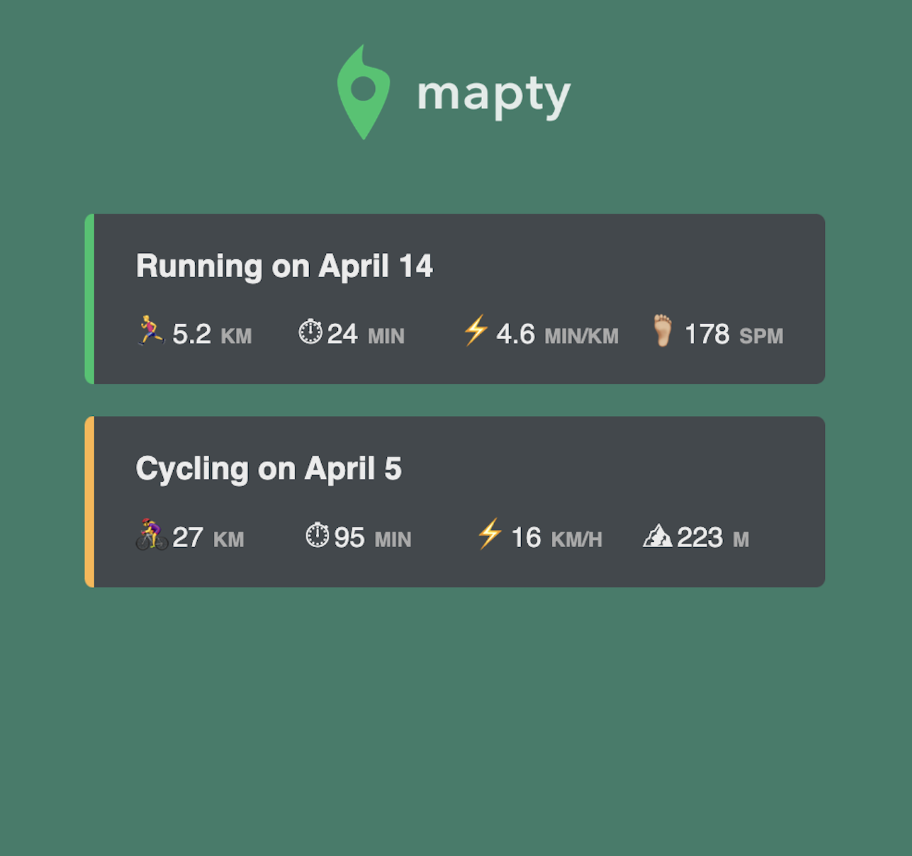

# Mapty Geo - Track Your Runs and Rides.

Mapty Geo is a web application designed for runners and cyclists to track, log, and explore their running and cycling routes using an interactive map.

  
  
# Getting Started

To use Mapty Geo, follow these simple steps:
1. Clone the Mapty Geo repository from GitHub: git clone https://github.com/bahumuhawa/mapty-geo
2. Open the index.html file in your preferred web browser.
